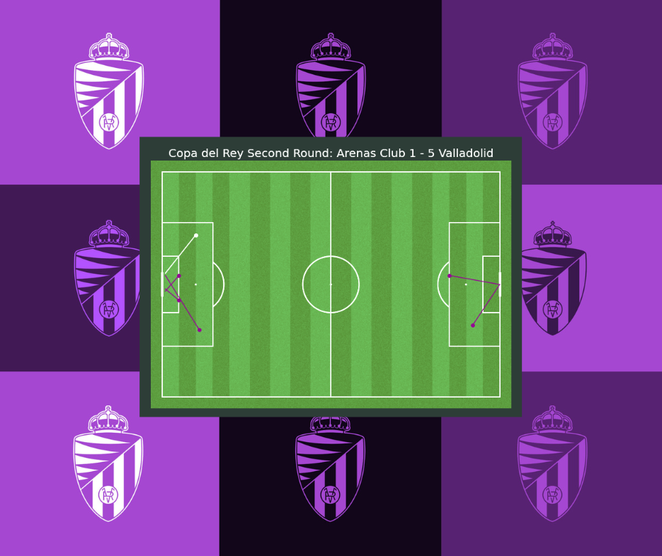
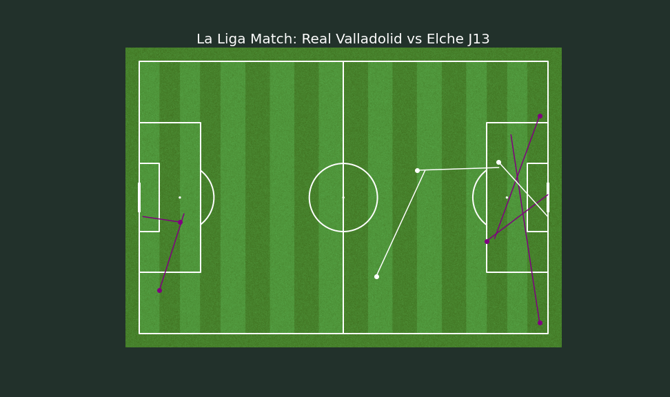

# Football Match Goal Visualization with Python

This repository contains a Python project that focuses on creating data visualizations for the scores and football field match goals. The project utilizes Python libraries and tools to analyze and present data in an interactive and visually appealing manner.

## Objective
The main objective of this project is to provide a comprehensive visualization of the scores and goals scored during football matches, specifically focusing on a local Spanish football team (Real Valladolid). By visualizing the data, we aim to gain insights into the team's performance, goal distribution, and match statistics.

## Features
- **Data Collection**: The project includes csv to collect match data, including scores and goals, from my own source. The data is obtained in a structured format for further analysis and visualization.
- **Score Analysis**: Using Python's data manipulation libraries, we perform various analyses on the scores, such as calculating average goals per match, identifying highest-scoring matches, and exploring trends in scoring patterns (work in progress).
- **Goal Visualization**: This project leverages Python's visualization libraries to create informative and visually appealing representations of goal distribution on the football field. The visualizations may include heatmaps, scatter plots, or other graphical representations to highlight the areas where goals were scored most frequently. But in this case I focused on the line map to represent the goal action.
- **Customization and Configuration**: The code is designed to be flexible and customizable. Users can easily modify parameters, such as team selection, time period, or visual styles, to tailor the visualizations according to their preferences.

## Requirements
To run this project, you will need the following dependencies:
- Python 3.x
- Data manipulation libraries (e.g., pandas, NumPy)
- Visualization libraries (e.g., Matplotlib, mplsoccer)

Please refer to the documentation of each library/framework for specific installation instructions.

## Contributing
Contributions to this project are welcome! If you encounter any issues, have ideas for improvements, or would like to add new features, please submit a pull request. For major changes, please open an issue first to discuss the proposed changes.

## License
This project is licensed under the [MIT License](LICENSE). Feel free to use and modify the code according to your needs.

## Acknowledgements
I would like to acknowledge the contributions of the open-source community and the libraries used in this project. Their efforts and support are invaluable in creating data visualizations and enhancing data analysis capabilities.

If you have any questions or suggestions, feel free to contact the project maintainer or open an issue in the repository. Enjoy exploring and visualizing football match goals with Python!
